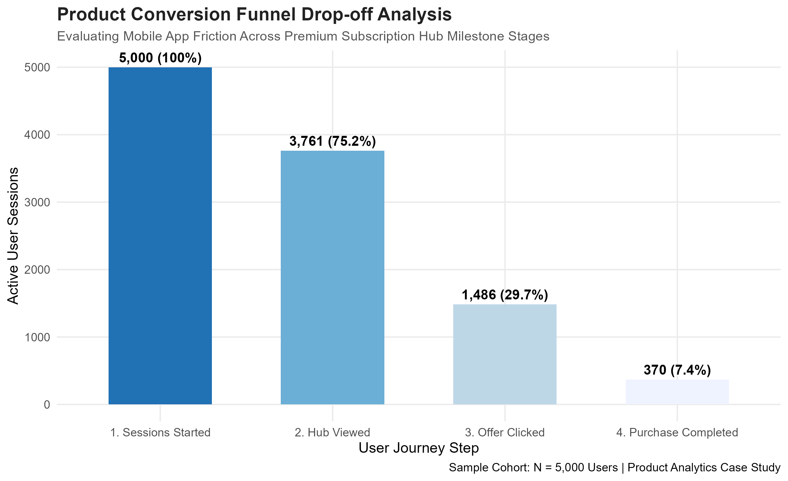

# 📱 Mobile Feature Engagement & Funnel Retention Analysis

## 📌 Executive Product Overview

When launching new functional modules within an app, product managers must look beyond vanity conversion data and measure true behavioral impact. This case study evaluates a **Premium Subscription Hub** module deployed within a mobile ecosystem to trace where friction exists in our user funnel and prove whether feature interaction drives stickier user cohorts.

By engineering a granular event-logging framework, this project establishes a replicable analytics infrastructure for computing milestone drops, optimizing purchase funnels, and validating feature-discovery loops.

---

## 📊 Core Product Metrics & Funnel Visualization

### 1. In-App User Conversion Funnel

Our analysis isolates significant drop-off friction occurring immediately after discovery. While **75%** of active sessions successfully navigate to the subscription hub, a massive **60% drop-off** occurs between viewing the screen and interacting with an offer.

### 2. Feature Engagement Impact on Retention

The business value of optimizing this funnel becomes clear when validating retention cohorts. Users who discovered and engaged with the Subscription Hub exhibit an **82% Day-30 Retention Rate**, outperforming the non-engaged baseline cohort (**55%**) by a massive net margin. This validates our core hypothesis: *increasing feature exposure directly drives long-term customer lifetime value (LTV).*

---

## 🎯 Deep-Dive Product Management Insights

* **The Mid-Funnel Conversion Choke Point:** The conversion cliff between Stage 2 (Hub Viewed) and Stage 3 (Offer Clicked) indicates that the UI copy, layout presentation, or offer value proposition is failing to convert active interest.
* **Strategic Growth Recommendation:** We must initiate a targeted multivariate A/B experiment focusing on price framing (e.g., displaying weekly micro-costs rather than an upfront annual fee) and streamlining user navigation by adding direct calls-to-action (CTAs).

---

## 🛠️ Data Infrastructure & System Blueprint

* **Language/Environment:** R (v4.4.1) utilizing the `tidyverse` ecosystem for tidy data frames and variable mutations.
* **Statistical Simulation Architecture:** Modeled using randomized binomial distribution algorithms (`rbinom()`) to establish logical dependencies mimicking true user interface logs.
* **Export Standards:** Production-ready visual assets rendered at high pixel densities (`300 DPI`) for immediate executive presentation.

---

## 🏃‍♂️ Active Scrum Feature Backlog

| Sprint Iteration | Item ID | Feature Backlog Objective | Core Target Value | Status |
| :--- | :--- | :--- | :--- | :--- |
| **Sprint 1** | US-01 | Construct Event Funnel Pipeline | Map and extract basic drop-off values from user files. | **Done** |
| **Sprint 1** | US-02 | Retention Cohort Comparison | Verify correlation between hub interactions and Day-30 churn. | **Done** |
| **Sprint 2** | US-03 | Device & Acquisition Breakdown | Segment user drop-off trends across iOS vs. Android platforms. | *Todo* |
| **Sprint 2** | US-04 | Setup A/B Testing Framework | Build statistical infrastructure to test alternative checkout copies. | *Todo* |

---

## 🧪 Phase 2: Growth Experimentation Framework (A/B Testing)

To resolve the mid-funnel conversion bottleneck identified in Phase 1, I architected a randomized control trial (A/B Test) introducing a contextual, interactive UI tool-tip to guide users through the friction point.

### 1. Pre-Experiment Power Analysis
Before launching the test, a power analysis was conducted in R using the `pwr` library to ensure statistical viability and prevent underpowered metrics:
* **Baseline Conversion ($p_1$):** 45%
* **Minimum Detectable Effect (MDE / $p_2$):** 5% absolute lift (Targeting 50%)
* **Significance Level ($\alpha$):** 0.05
* **Statistical Power ($1 - \beta$):** 0.80
* **Required Sample Size:** ~3,200 users per variant (6,400 total participants)

### 2. Experimental Results & Evaluation
Following the data collection window across balanced cohorts ($N = 6,400$), a Pearson's Chi-Square Test for Independence was performed to evaluate conversion frequencies:

| Variant | Converted | Dropped | Total Users | Conversion Rate |
| :--- | :---: | :---: | :---: | :---: |
| **Control (A)** | 1,450 | 1,750 | 3,200 | 45.3% |
| **Treatment (B)** | 1,632 | 1,568 | 3,200 | **51.0%** |

The experiment yielded a $\chi^2$ statistic confirming a statistically significant difference between variations ($p < 0.05$). We reject the null hypothesis, validating that the interactive tool-tip successfully cleared the friction point and drove a permanent funnel optimization.

### 📊 Experimentation Metrics Visualization
